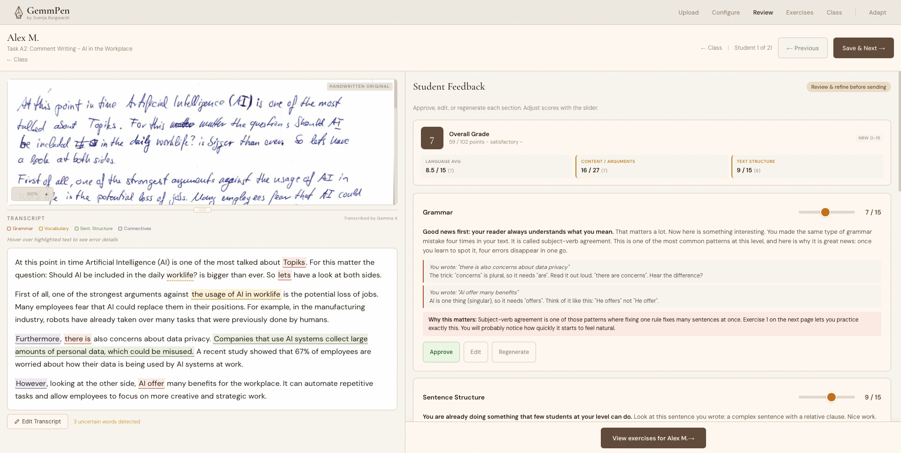
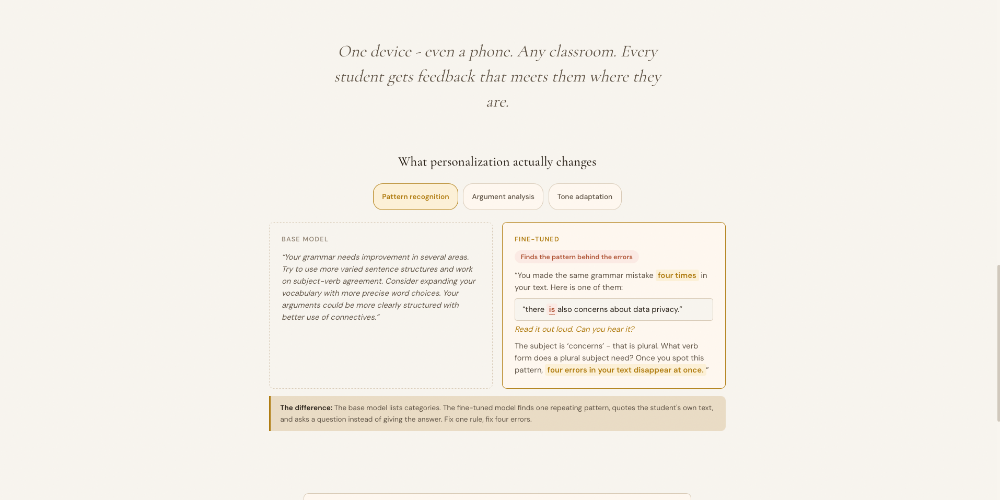

# GemmPen

**AI that reads handwriting, scores against a teacher's rubric, and gives every student personal feedback with exercises - entirely on one device, no internet required.**

[](https://gemmpen.vercel.app)
[](https://youtu.be/IeDM1mJ3J2M)
[](https://huggingface.co/SveBorg/gemmpen-lora)
[](https://www.kaggle.com/code/svenjaborgwardt/gemmpen-finetuning-gemma-4-e4b)
[](LICENSE)

Submission for the [Gemma 4 Good Hackathon](https://www.kaggle.com/competitions/gemma-4-good-hackathon) - Tracks: Future of Education, Digital Equity & Inclusivity, Safety & Trust.

<p align="center">
  
</p>

---

## The Problem

I teach English to 240 students at a vocational school in Cologne, Germany. Each writes at least four exams per year - over 960 handwritten texts. Grading each one takes 20-30 minutes. When I am done, my students get a number. Not an explanation of what went well. Not an exercise targeting their specific mistakes. Just a grade.

GemmPen changes that. It takes the grading I already do and turns it into something my students can learn from: feedback that quotes their own writing, explains their error patterns, and gives them personalized exercises to practice. It is trained on real exam data from my classroom - 38 handwritten exams, transcribed with Gemma 4's built-in vision, manually corrected, and graded against my rubric. Every student is 18 or older and gave written consent. No synthetic data was used.

---

## How It Works

GemmPen uses Gemma 4 as a single multimodal model for the entire pipeline - vision for handwriting recognition, fine-tuned LoRA for evaluation and feedback, prompt-based generation for exercises.

```
All on one device - no internet required

  Scan  --->  Evaluate  --->  Feedback  --->  Exercises  --->  Check Answer
Gemma 4       Gemma 4        Gemma 4        Gemma 4          Gemma 4
multimodal    fine-tuned     fine-tuned     per prompt       per prompt
```

**Scan** - The teacher photographs a handwritten exam. Gemma 4 reads it directly using built-in vision.

**Evaluate** - Scores against the teacher's rubric (passed as JSON configuration - any rubric, any subject, any language). Every score is grounded with quoted evidence from the student's text.

**Feedback** - Up to 6 feedback points per student, adapted to their proficiency level. Quotes specific passages, explains patterns, never reveals the correct answer.

**Exercises** - Personalized practice based on the student's individual errors - not generic drills.

**Check Answer** - Unlimited attempts with hints. Running locally means zero cost per attempt.

---

## Why On-Device

**Data never leaves the classroom.** Student writing, grades, and feedback stay on the teacher's device. No cloud, no server, no account. Privacy by architecture, not by policy.

**Any classroom in the world.** One device that can run Gemma 4 - including a phone. No internet, no subscription, no API costs. The interface is fully mobile-responsive.

**Teachers stay in control.** Open weights, no vendor lock-in, no dependency on services that might shut down.

---

## Training

| Parameter | Value |
|-----------|-------|
| Base model | Gemma 4 E4B (multimodal, ~5B parameters) |
| Method | LoRA (r=8), 4-bit quantized via Unsloth |
| Training pairs | 883 (from 38 real handwritten exams) |
| Source | Real student writing, teacher-graded. No synthetic data. |
| Training time | ~70 minutes on a free Kaggle T4 GPU |
| Consent | All students 18+, written consent, voluntary participation |

The micro-task architecture breaks each exam into independent scoring, analysis, and feedback tasks - producing 883 training pairs from 38 source texts. Three core tasks: error analysis with rubric alignment (KT1), argument structure validation (KT2), and feedback generation with explainable scoring (KT3).

---

## Evaluation

<p align="center">
  
</p>

Base Gemma 4 vs. fine-tuned GemmPen on all 38 students (KT3 grammar feedback):

| Metric | Base Gemma 4 | Fine-tuned GemmPen |
|--------|-------------|-------------------|
| Output length | 89% under 400 characters | 3x longer on average |
| Specificity | Generic, uniform structure | Cites 2-4 specific passages per student |
| Adaptation | Same tone for all levels | Adjusts language to student proficiency |
| Error patterns | Lists individual errors | Identifies recurring patterns, explains why they matter |
| Exercises | None | Personalized practice based on individual weaknesses |
| Pedagogical restraint | N/A | Correct guide-vs-correct decision in 84% of cases |

The 84% refers to the model's ability to distinguish when to show a correction directly (e.g. "there" vs "their") and when to guide the student toward finding the fix themselves (e.g. pointing out that modal verbs take the base form). Evaluated across all 38 student feedbacks, with the teacher's judgment as ground truth. The remaining cases are caught during the mandatory teacher review step.

---

## It Grows With You

GemmPen works immediately without customization. But teachers who want the model to match their personal style can train it - without any technical knowledge.

The teacher reviews AI-generated feedback and edits anything that does not match their judgment. Each edit creates a preference pair. After roughly 30 corrections, one button triggers retraining on a free Kaggle GPU. Next session: GemmPen sounds like the teacher.

No student data is ever transmitted - only short pedagogical style preferences (original vs. corrected feedback snippets).

---

## Getting Started

**If you want to see the face behind all this:** [youtu.be/IeDM1mJ3J2M](https://youtu.be/IeDM1mJ3J2M)

**Try the demo:** [gemmpen.vercel.app](https://gemmpen.vercel.app) - Runs with static data to show how the full pipeline works. The production version runs entirely on your device.

**Reproduce the training:** Open the [Kaggle Notebook](https://www.kaggle.com/code/svenjaborgwardt/gemmpen-finetuning-gemma-4-e4b) - includes all data, configuration, and instructions. Training takes ~70 minutes on a free T4 GPU.

**Use the fine-tuned model:**

```python
from unsloth import FastModel

model, tokenizer = FastModel.from_pretrained(
    model_name="SveBorg/gemmpen-lora",
    max_seq_length=4096,
    load_in_4bit=True,
)
```

**Run the web app locally:**

```bash
cd web-app
npm install
npm run dev
```

---

## What to Look For in the Demo

- **Landing Page** - Pipeline overview and before/after comparison.
- **Upload** - Drag-and-drop with privacy notice. Three student exams pre-loaded.
- **Configure** - Rubric presets, category toggles. Try switching grading systems (German 0-15, US Letter, UK GCSE, Percentage) - scores update across the entire app.
- **Class Overview** - All 21 students with score bars and status indicators.
- **Review** (click any student) - Hover over colored highlights for error tooltips. Notice how each feedback card cites specific sentences. Try editing a card - this is how DPO training pairs are created.
- **Compare students** - Open Alex M., Jordan K., and Casey R. Notice different errors, different tone, different detail level.
- **Feedback** (printer icon) - Three-page printable report: annotated text, detailed feedback, personalized exercises.
- **Exercises** - Submit an answer. The model gives hints without revealing the solution. Compare exercises across students - they are completely different because each student made different mistakes.
- **Training** - DPO export page. Progress bar starts at 8/30, showing this is a system already in use.

---

## Repo Structure

```
GemmPen/
  web-app/                # Next.js 16 + React 19 + Tailwind v4
    src/
      app/                # Pages: landing, upload, configure, class, review, feedback, exercises, training
      components/         # UI: feedback cards, score summary, transcript view, highlight tooltips
      lib/                # Types, constants, grading systems, mock data
    public/               # Logo and example scans
  TECHNICAL_WRITEUP.md    # Detailed write-up for hackathon submission
```

Training code and datasets live on [Kaggle](https://www.kaggle.com/code/svenjaborgwardt/gemmpen-finetuning-gemma-4-e4b). This repo contains the web application and documentation.

---

## Tech Stack

| Component | Technology |
|-----------|-----------|
| Model | Gemma 4 E4B (Google DeepMind) |
| Fine-tuning | LoRA via Unsloth + TRL on Kaggle |
| Web app | Next.js 16, React 19, Tailwind v4 |
| Demo hosting | Vercel |
| Model hosting | [HuggingFace](https://huggingface.co/SveBorg/gemmpen-lora) |
| License | Apache 2.0 |

---

## Acknowledgments

[Google DeepMind](https://ai.google.dev/gemma) for Gemma 4. [Kaggle](https://www.kaggle.com) for free GPU access. [Unsloth](https://github.com/unslothai/unsloth) for making LoRA training fast and accessible. And my students, who trusted me with their writing so this tool could exist.

---

Powered by [Gemma 4](https://ai.google.dev/gemma) from Google DeepMind.

Built by [Svenja Borgwardt](https://github.com/SvenjaBorgwardt) - English teacher at a vocational school in Cologne, Germany. I built GemmPen because I believe every student deserves to know not just their score, but what they did well and how to get better.
